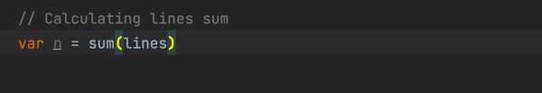

# comment-checker

<b><!-- Plugin description -->
Avoid forgetting comments behind
<!-- Plugin description end --></b>

## Motivation ##

Writing comments is more often than not a code smell for an unreadable code. However, there are scenarios where some
complicated code (i.e., implementing algorithmic ideas, implementing adapters to legacy components, etc.) should have a
well-documented comment right above it. Unfortunately, comments may find themselves drifting away from the code they are
describing as developers sometime skip updating the comment after every code change.

Therefore, **`comment-checker` plugin will highlight for you the comments you need to update when changing a piece of
code!**

## Install ##

Install `comment-checker` from the Intellij marketplace on any JetBrains IDE.

## Contribute ##

To be completed.

## Future work ##

- [ ] Better estimation of "all relevant code for a comment"
- [ ] Establish an explicit connection between a comment and a piece of code
- [ ] Check that the comment is informative using a neural language model
- [ ] Check that the comment is related to the matched code